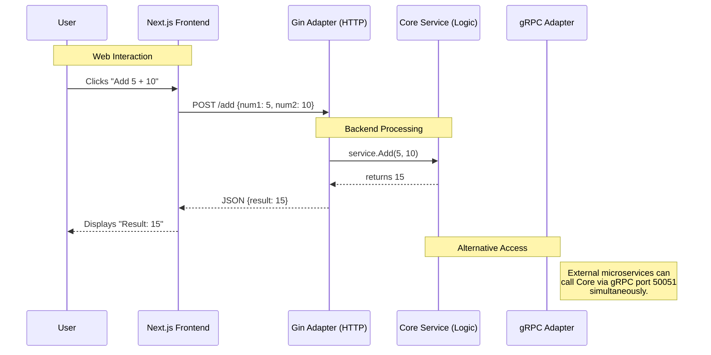

# Go gRPC & HTTP Calculator Service

A production-grade implementation of a Calculator Service using **Clean Architecture**. This project demonstrates how to build a Dual-Protocol Microservice (gRPC + HTTP) using **Go** for the backend and **Next.js** for the frontend, fully containerized for deployment.

Based on the original gRPC concept by Engr. [cite\_start]Daniel Moune[cite: 1, 2], upgraded to a modern web stack.

-----

## 🏗 Architecture

This project strictly follows **Clean Architecture** (Hexagonal Architecture) principles. The goal is to separate the business logic (Core) from the delivery mechanisms (HTTP/gRPC) and the user interface.

### The "Dual-Protocol" Design

The backend exposes two "ports" (entry points) simultaneously:

1.  **Primary Port (gRPC - `:50051`)**: For high-performance internal communication between microservices.
2.  **Secondary Port (HTTP/Gin - `:8080`)**: Acts as an API Gateway/Adapter for the web frontend.

### Layers

* **Domain (Core):** Pure Go business logic. It knows nothing about JSON, HTTP, or gRPC. It simply calculates numbers.
* **Adapters (Infrastructure):**
    * **gRPC Adapter:** Maps Protobuf requests to the Core Service.
    * **HTTP Adapter (Gin):** Maps JSON REST requests to the Core Service.
* [cite\_start]**Contract:** Defined via Protocol Buffers (`calculator.proto`), serving as the single source of truth for the API definition[cite: 31, 39].

### Sequence Diagram

Here is the flow of data when a user performs a calculation via the web interface:



-----

## 📂 Project Structure

```text
calculator-app/
├── proto/               # Protocol Buffer definitions (The Contract)
├── backend/             # Go Backend
│   ├── cmd/server/      # Main entry point (starts Gin + gRPC)
│   ├── internal/
│   │   ├── core/        # Pure Business Logic (Service Layer)
│   │   └── adapter/     # Protocol Adapters (gRPC Server, Gin Handlers)
│   └── pkg/pb/          # Generated Go Code from Protobuf
├── frontend/            # Next.js 14 Frontend
│   ├── app/             # App Router pages
│   └── lib/             # API clients
├── docker-compose.yml   # Local orchestration
└── .github/workflows/   # CI/CD Pipeline
```

-----

## 🚀 Getting Started

### Prerequisites

* **Go**: v1.22+
* **Node.js**: v18+
* **Docker** (Optional, for container run)
* **Protoc Compiler** (Only if modifying `.proto` files)

### Option 1: Quick Start (Docker Compose)

The easiest way to run the entire stack (Backend + Frontend) is using Docker.

1.  **Clone the repository:**

    ```bash
    git clone https://github.com/YOUR_USERNAME/calculator-service.git
    cd calculator-service
    ```

2.  **Run with Compose:**

    ```bash
    docker-compose up --build
    ```

3.  **Access the App:**

    * **Frontend:** Open [http://localhost:3000](https://www.google.com/search?q=http://localhost:3000)
    * **Backend API:** [http://localhost:8080](https://www.google.com/search?q=http://localhost:8080)
    * **gRPC Server:** `localhost:50051`

-----

### Option 2: Run Locally (Manual)

If you want to develop and run the services individually without Docker:

#### 1\. Backend Setup (Go)

```bash
cd backend

# Install dependencies
go mod tidy

# Run the server
go run cmd/server/main.go
```

*Output:* \> `gRPC Server listening on port 50051`

> `HTTP Gin Server listening on port 8080`

#### 2\. Frontend Setup (Next.js)

Open a new terminal:

```bash
cd frontend

# Install dependencies
npm install

# Run the development server
npm run dev
```

*Output:*

> `Ready in 5.4s`
> `url: http://localhost:3000`

-----

## 🛠 Features Implemented

* [cite\_start]**Operations:** Supports all 5 operations defined in the original specification[cite: 44, 45]:
    * Addition (`Add`)
    * Subtraction (`Sub`)
    * Multiplication (`Mul`)
    * Division (`Div`) - *includes error handling for div by zero*
    * Modulo (`Mod`)
* [cite\_start]**Type Safety:** Uses Protobuf `int32` types for consistent data handling across languages[cite: 50, 58].
* [cite\_start]**Concurrency:** The Go backend handles the HTTP and gRPC listeners in concurrent goroutines, mirroring the thread pool concept from the Python reference[cite: 204].
* **CI/CD:** Includes GitHub Actions workflow to auto-build and push Docker images to GHCR on every push to `main`.

-----

## 🐳 Deployment

This project is configured for containerized deployment.

* **Frontend:** Built as a standalone Next.js artifact (minimal size).
* **Backend:** Built as a static Go binary running on a `distroless` image (high security, \<20MB size).

**CI/CD Pipeline:**
The `.github/workflows/deploy.yml` file automatically:

1.  Logs into GitHub Container Registry (GHCR).
2.  Builds the Backend and Frontend images.
3.  Pushes them with tags `:latest` and `:sha-<commit-hash>`.

-----

## 📜 References

* Concept based on "gRPC Implementation: Calculator Service" by Engr. [cite\_start]Daniel Moune[cite: 1, 2].
* gRPC Official Documentation: [grpc.io](https://grpc.io/)
* Protocol Buffers: [developers.google.com/protocol-buffers](https://developers.google.com/protocol-buffers)

-----

**Author:** Zingui Fred Mike
**License:** MIT